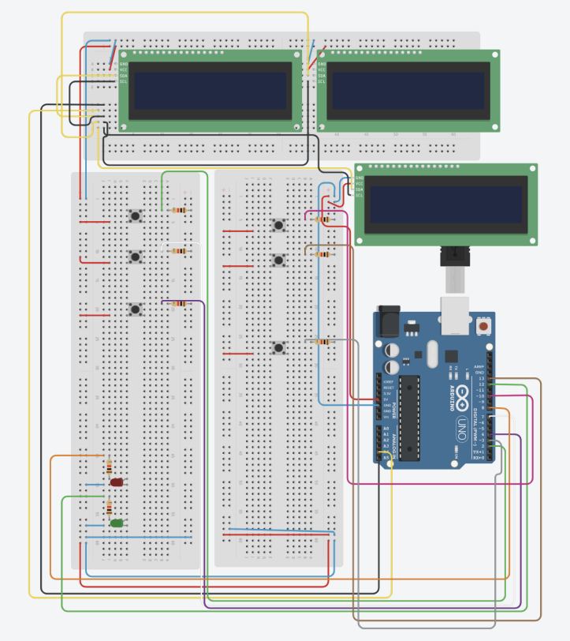
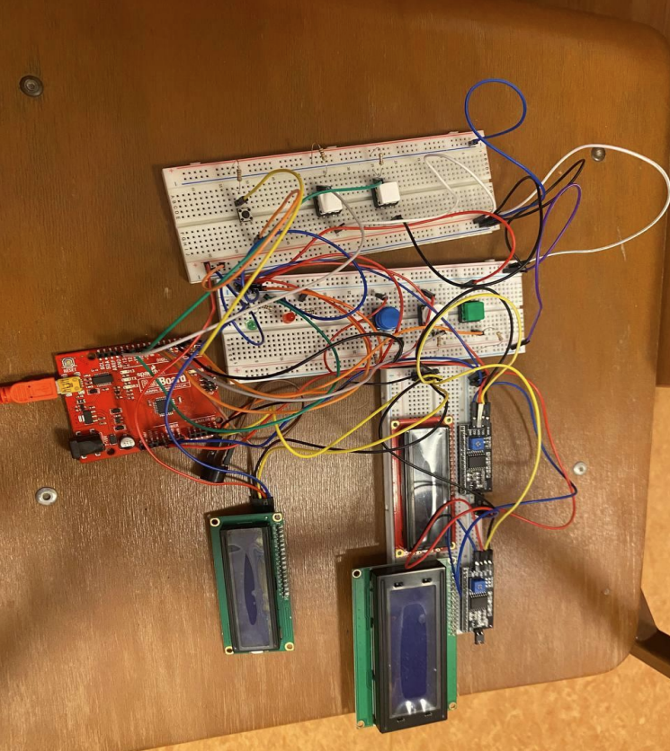

# StockTracker Project

## Schema



## Overview



StockTracker is an application developed to simplify stock tracking and management for users through continuous monitoring and updates of stock statuses. This project leverages Arduino and Python to achieve its objectives.

## Components Used

- Arduino Uno
- Wires
- 6 Buttons
- Resistors (various OHM values)
- 2 LEDs (Red, Green)
- 2 LCD Displays with I2C modules (expandable to 3 displays)
- Buzzer

## Project Architecture

### API

The project utilizes the XTB trading platform for retrieving stock data. The platform's API provides access to information about stocks, orders, history, and candlesticks. You can choose any platform with a suitable API for your needs.

#### API Documentation

- [XTB API Documentation](http://developers.xstore.pro/documentation/)
- [XTB Platform](https://www.xtb.com/pl)

### API Wrappers

To interact with the XTB API, custom wrappers are used to overcome limitations in the official wrappers.

#### References

- [API Wrapper by federico123579](https://github.com/federico123579/XTBApi)
- [API Wrapper by Saitama298](https://github.com/Saitama298/Python-XTB-API)

### Account Setup

To access XTB data, you need an account. Both official and demo accounts can be used. For this project, a demo account is used for simplicity.

### Code Overview

The project involves serial communication between the Arduino and a PC, using the following Python libraries:

```python
import serial
import time
import sys
from API import XTB  # Saitama's wrapper
from XTBApi.api import Client  # Federico's wrapper
```

### Serial Communication

Setting up Serial Communication
Ensure the same baud rate on both the Arduino and the Python script:

```python
ser = serial.Serial('COM5', 9600, timeout=0.1)
```

```c++
#define BRATE 9600

void setup() {
    Serial.begin(BRATE);
}
```

### Python to Arduino Communication

The Python script sends data to the Arduino in a predefined format. Example function to send data:

```python
def send_data2(name, p, ind, balance, lmin, lmax, lstep, curLot, margin, disOrderId):
    if 4 in ind:
        if float(p['change'] >= 0):
            write("M1:G;")
        else:
            write("M1:R;")

    if 1 in ind:
        write("M2:C;")
        time.sleep(.1)
        write("M3:"+ f"{name}: {p['current']};")

    if 3 in ind:
        write("M4:" + f"{p['percent_change']:.2f}%" + f" {p['change']};")

    write("M5:" + "Account: " + "14851646;")
    write("M6:Balance: " + str(balance)+";")
    write("M7:" + str(lmin) + ";")
    write("M8:" + str(lmax) + ";")
    write("M9:" + str(lstep) + ";")
    write("M10:" + str(curLot) + ";")
    write("M11:" + str(margin) + ";")
    write("M12:" + str(disOrderId) + ";")
```

### Arduino to Python Communication

The Arduino sends data back to the PC using the Serial.write() command. Example of handling buttons:

```c++
#define PIN_BUTST 4
#define PIN_BUTMOD 7
#define PIN_BUTACT 2
#define PIN_BUTORDER 3
#define PIN_BUTINC 13
#define PIN_BUTDEC 10

void loop() {
    if (digitalRead(PIN_BUTST) == HIGH) {
        Serial.write("STOCK");
    }
    // Other button handling code...
}
```

### Handling User Input

```python
def determine_indicators():
    available_indicators = [1, 2, 3, 4, 5]
    target_indicators = []
    choice = 0

    while choice != 5:
        print("Please select your desired indicators: (Note, certain indicators may require additional Arduino setup.)")

        for indicator in available_indicators:
            if indicator == 1:
                print("1. Current Stock Price (###: XX.XX)")
            elif indicator == 2:
                print("2. Change Since Open (+X.XX)")
            elif indicator == 3:
                print("3. Percent Change Since Open (-X.XX%)")
            elif indicator == 4:
                print("4. Day Change Indicator Light (Green light or Red Light)")
            elif indicator == 5:
                print("5. Finish Program Setup")

        choice = int(input("Choice (1-5): "))

        if choice in available_indicators and choice != 5:
            available_indicators.remove(choice)
            target_indicators.append(choice)
        elif choice != 5:
            print("Not a valid selection.")

    return target_indicators
```

### Example of Serial Communication

```python
def send_data2(name, p, ind, balance, lmin, lmax, lstep, curLot, margin, disOrderId):
    if 4 in ind:
        if float(p['change'] >= 0):
            write("M1:G;")
        else:
            write("M1:R;")

    if 1 in ind:
        write("M2:C;")
        time.sleep(.1)
        write("M3:"+ f"{name}: {p['current']};")

    if 3 in ind:
        write("M4:" + f"{p['percent_change']:.2f}%" + f" {p['change']};")

    write("M5:" + "Account: " + "14851646;")
    write("M6:Balance: " + str(balance)+";")
    write("M7:" + str(lmin) + ";")
    write("M8:" + str(lmax) + ";")
    write("M9:" + str(lstep) + ";")
    write("M10:" + str(curLot) + ";")
    write("M11:" + str(margin) + ";")
    write("M12:" + str(disOrderId) + ";")
```

## Hardware Setup

To use multiple LCDs with I2C modules, the following addresses are used:

```c++
#define LCD1 0x22
#define LCD2 0x27
#define LCD3 0x23
```

For detailed instructions on connecting multiple LCDs to Arduino, refer to this [article](https://electronics-project-hub.com/how-to-connect-multiple-lcd-to-arduino/).

### Soldering I2C Module

To change the I2C address, solder the appropriate bridges on the module as shown in the tutorial(arddoc.pdf).

### Contributing

If you'd like to contribute to this project, please fork the repository and use a feature branch. Pull requests are welcome.
